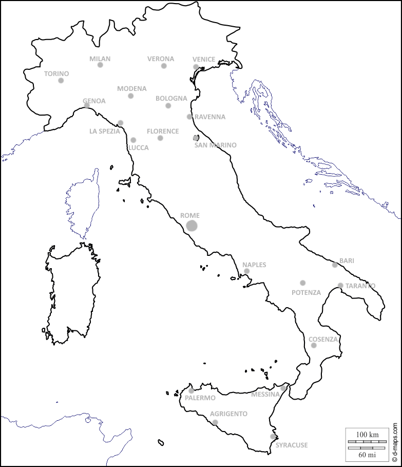
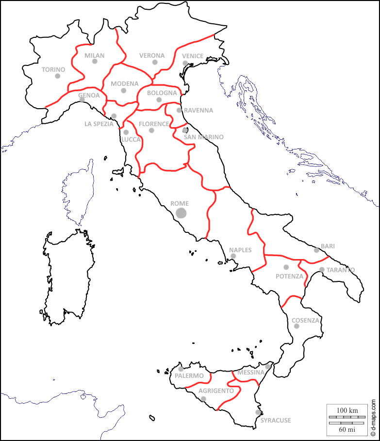

# Map

## Content

Map would be zoomable, with fixed locations (unclaimed land) to found a town. Spots would be drawn to resemble historic places. This achieves that map is not over or under crowded and retain wilderness feeling of middle age.

Each town location has land around it, that forms a province together with it. (In rest of this document, town and province can be used interchangeably).

At the start, there will be few towns founded by administration, the majority of the map will have to be created by players through gameplay.

### Towns 

More in [Town page](towns.md)

### Travelling

The main travelling routes will be on the roads.

Roads must be built. They can be built only with approval of both province leaders. They will cost some resources and working hours. Construction can be done from both towns.

Player will be able to travel between adjacent provinces even if there is no road, but travel time will be drastically increased. (Shortest route may not necessarily be the fastest).

Speed of travelling also depends on terrain.

## Tech

Map will be drawn using SVG, so we can dinamically display roads and some other stuff (sieges?)

